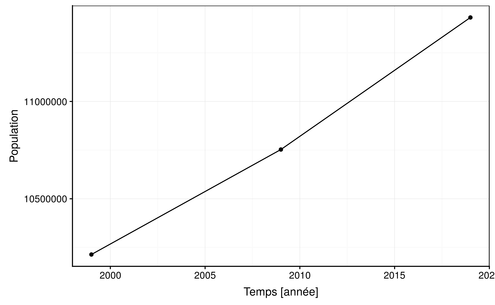

<!-- Do not edit de README.md -->

```{r setup, include=FALSE}
knitr::opts_chunk$set(echo = TRUE, message = FALSE, warning = FALSE)
library(flow)
library(data.io)
```

## Contexte

L’office belge de statistique , Statbel, diffuse des données fiables sur l’économie, la société et les territoire belges.

Pour en apprendre plus sur l’office belge de statistique, vous pouvez consulter le lien suivant : <https://statbel.fgov.be/fr/propos-de-statbel>

Nous souhaitons analyser l’évolution de la population belge entre le 1 janvier 1992 et le 1 janvier 2019.

Les données proposées par statbel ont une structure particulière et toujours la même.

```{r}
read("data/bel.csv") %>.%
  knitr::kable(.)
```

On retrouve plusieurs colonnes de type factor qui décrivent la population donnée puis des variables qui recensent la densité de population pour des années particulières. Les différentes tables sont regroupé dans la base de données `popu_belge_db.sqlite`

Il faut donc créer un objet de class `belpop` qui va remanier les données afin d'avoir un tableau similaire au tableau ci-dessous. 

```{r}
read("data/bel_lg.csv") %>.%
  knitr::kable(.)
```

Afin de faciliter l'analyse rapide des données, il vous est demandé de faire une fonction générique de type plot() ou autoplot() similaire au graphique ci-dessous pour aider les analystes de la plateforme statbel.



## Attendu

- Se connecter et extraire des données de la base de données

- Créer un objet spécifique à l'analyse de données de la population belge. Cet objet sera de classe `belpop` 

- Remanier les données à l'aide de fonctions 

- Réaliser une fonction générique pour afficher un graphique spécifique au objet `belpop`

- Réaliser un petit rapport qui décrit votre analyse de la population belge se basant sur une question de votre choix. Tous les tableaux et graphiques doivent être légendés. 

- Documenter toutes les fonctions en lien avec l'objet belpop

- Modulariser votre code
